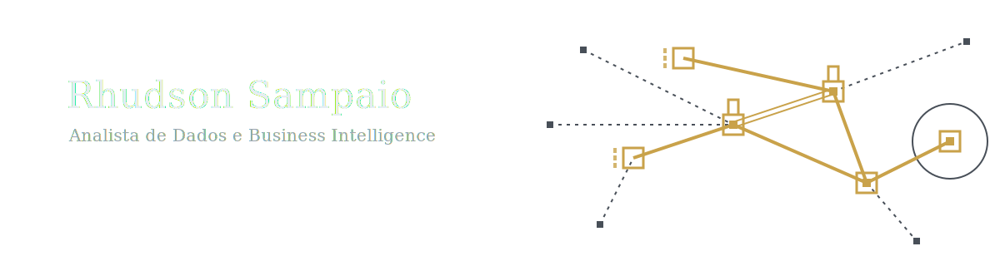

<picture>
  <source media="(prefers-color-scheme: dark)" srcset="./assets/profile-cover-dark.svg">
  <source media="(prefers-color-scheme: light)" srcset="./assets/profile-cover-light.svg">
  
</picture>

**Analista de Dados e Business Intelligence**

Trabalho com dados na indústria farmacêutica, transformando informações operacionais em análises claras para apoiar decisões de negócio.

## Atuação

Atuo com análise de dados, Business Intelligence e SQL em contexto corporativo.

Meu trabalho envolve extração, validação e organização de dados, construção de dashboards gerenciais, modelagem de indicadores e estruturação de bases analíticas a partir de sistemas empresariais, especialmente ERP.

Também venho aprofundando fundamentos de Ciência de Dados e Engenharia de Dados, com foco em qualidade, integração e organização da informação.

## Stack

SQL · Python · Power BI · Excel · Sankhya ERP
DuckDB · PostgreSQL · Docker · Debian Linux · Git

## Em estudo

Ciência de Dados e Inteligência Artificial, com interesse em análise de dados, Graph Neural Networks, Teoria dos Grafos e fundamentos de arquitetura de dados.

## Contato

LinkedIn: https://www.linkedin.com/in/rhudson-sampaio
